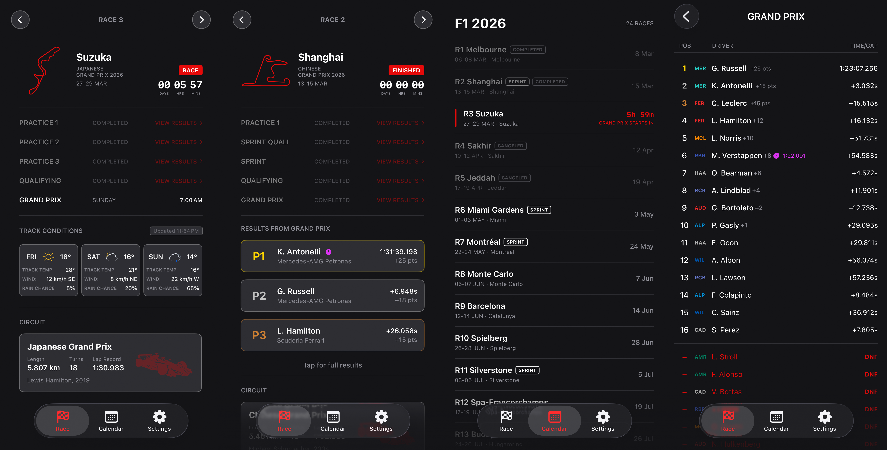
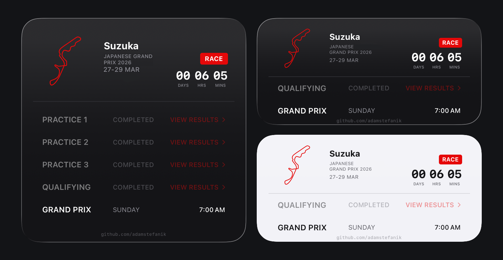

  

# F1 Calendar Widget

A sleek iOS app and widget for the 2026 Formula 1 season. Track every race weekend with live countdowns, full session schedules, results, weather forecasts, and circuit info — all in your pocket.

## Features

**App**
- Full 2026 race calendar with detailed race weekends
- Live countdown to the next session (days, hours, minutes)
- Session results with podium highlights, fastest laps, and driver standings
- Weather forecast for upcoming race weekends
- Circuit information with track maps
- Push notifications before sessions start
- Sprint weekend detection and adjusted schedules

**Widget**
- Medium and large Home Screen widgets
- Live countdown to the next race
- Full session schedule with local times
- Current session badge (live / upcoming)
- Country flags for all race locations

## Screenshots

  
  &nbsp;&nbsp;
  

## Data Sources

- **Race & session data** — [OpenF1 API](https://openf1.org) with 6-hour cache and built-in 2026 calendar fallback
- **Weather** — [OpenWeatherMap API](https://openweathermap.org) with per-circuit caching
- **All times** displayed in your local timezone

## Tech Stack

- **SwiftUI** + **WidgetKit**
- **Swift Concurrency** (async/await)
- **No external dependencies**

## Requirements

- Xcode 16+
- iOS 17+

## Getting Started

1. Clone the repository
2. Open `F1CalendarWidget.xcodeproj` in Xcode
3. Build and run on a simulator or device
4. Add the widget to your Home Screen

## License

MIT — see [LICENSE](LICENSE) for details.

---

  Made with racing heart by <a href="https://github.com/adamstefanik">Adam Samuel Štefánik</a>

