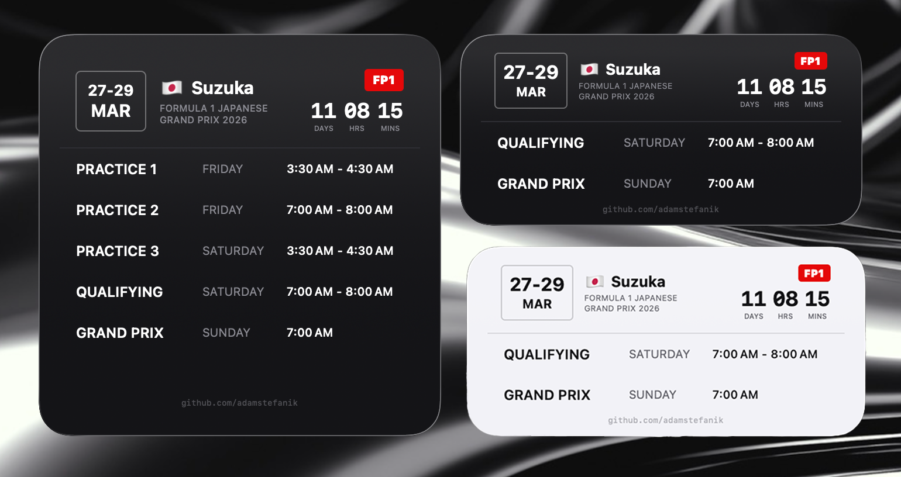

# F1 Calendar Widget

F1 2026 race calendar widget for iOS — upcoming races, countdowns, and session times in your local timezone.

<p align="center">
  
</p>

## Features

- **3 widget sizes** — small, medium, and large to fit your Home Screen
- **Live countdown** — days, hours, and minutes until the next race
- **Full session schedule** — FP1, FP2, FP3, Qualifying, Sprint, and Grand Prix
- **Sprint weekend support** — automatically detects and adjusts for sprint formats
- **Local timezone** — all session times converted to required timezone
- **Country flags** — emoji flags for all race locations
- **Current session badge** — highlights which session is live or coming up next
- **Offline-ready** — 6-hour cache with a hardcoded 2026 calendar as fallback

## Data Source

Race and session data is fetched from the [OpenF1 API](https://openf1.org). The widget refreshes every 60 minutes and caches responses for 6 hours. If the API is unavailable, it falls back to a built-in 2026 calendar.

## Project Structure

```
F1WidgetExtension/
├── F1WidgetBundle.swift    
├── F1WidgetViews.swift     
├── F1APIService.swift      
├── F1Calendar.swift        
├── F1Colors.swift          
├── Race.swift              
└── Assets.xcassets/        
F1CalendarWidget/
├── F1CalendarWidgetApp.swift
└── ContentView.swift
```

## Tech Stack

- **SwiftUI** + **WidgetKit**
- **Swift Concurrency** (async/await)
- **No external dependencies**

## Requirements

- Xcode 16+
- iOS 17+

## Getting Started

1. Clone the repository
2. Open `F1CalendarWidget.xcodeproj` in Xcode
3. Select the `F1WidgetExtensionExtension` scheme
4. Build and run on a simulator or device
5. Add the widget to your Home Screen

## License

MIT — see [LICENSE](LICENSE) for details.

Made with :checkered_flag: by [Adam Samuel Štefánik](https://github.com/adamstefanik)
